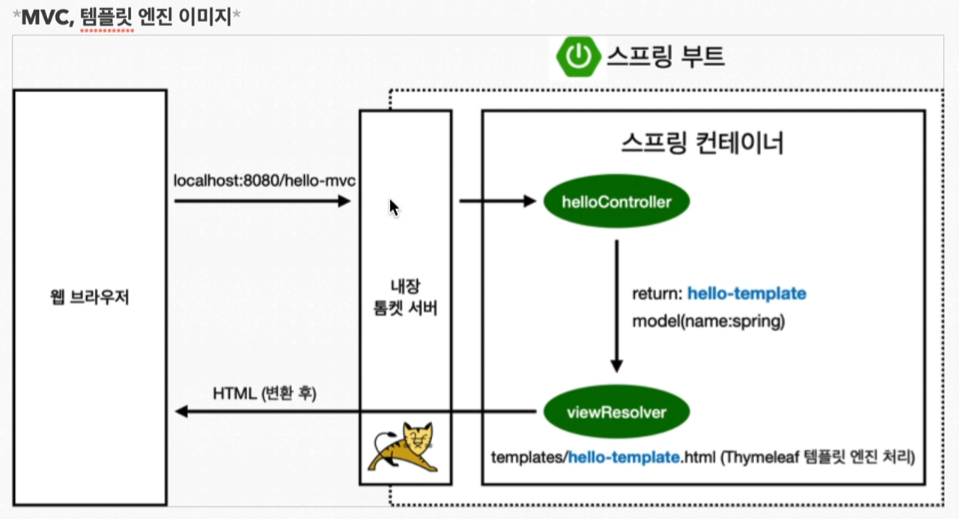
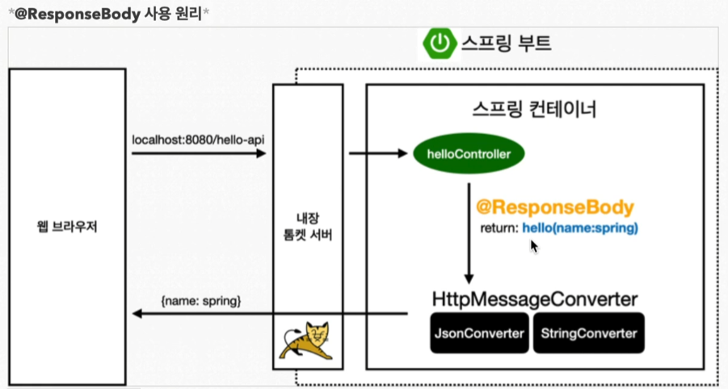

# 1강 - 스프링 웹 개발 기초

## 정적 컨텐츠
* 스프링 부트 정적 컨텐츠 기능
* https://docs.spring.io/spring-boot/docs/current/reference/htmlsingle/#web.servlet.spring-mvc.static-content

`src/resources/static/hello-static.html`
```html
<!DOCTYPE html>
<html lang="en">
<head>
    <meta charset="UTF-8">
    <title>static content</title>
</head>
<body>
  정적 컨텐츠입니다.
</body>
</html>
```
* 실행 : http://localhost:8080/hello-static.html

## MVC와 템플릿 엔진
> Model, View, Controller

* 실행: http://localhost:8080/hello-mvc?name=shrimp

### Controller
`src/main/java/hello.hellospring/controller/HelloController.java`
```java
@Controller
public class HelloController {
    @GetMapping("hello-mvc")
    public String helloMvc(@RequestParam(value = "name") String name, Model model) {
        model.addAttribute("name", name);
        return "hello-template";
    }
}
```

### View
`src/resources/templates/hello-template.html`
```html
<!DOCTYPE html>
<html xmlns:th="http://www.thymeleaf.org">
<head>
  <meta charset="UTF-8">
  <title>Hello Template</title>
</head>
<body>
  <p th:text="'안녕하세요. ' + ${name}"></p>
</body>
</html>
```



## API

### String 출력
```java
@Controller
public class HelloController {
    @GetMapping("hello-string")
    @ResponseBody
    public String helloString(@RequestParam("name") String name) {
        return "hello " + name;
    }
}
```
* 실행: http://localhost:8080/hello-string?name=shrimp
* 결과: hello name

### Json 출력
```java
@Controller
public class HelloController {
    static class Hello {
        private String name;
        public String getName() { return name; }
        public void setName(String name) { this.name = name; }
    }

    @GetMapping("hello-api")
    @ResponseBody
    public Hello helloApi(@RequestParam("name") String name) {
        Hello hello = new Hello();
        hello.setName(name);
        return hello;
    }
}
```
* 실행: http://localhost:8080/hello-api?name=shrimp
* 결과: { "name": "shrimp" }

### @ResoponseBody 사용 원리

* HTTP의 BODY에 문자 내용을 직접 반환
* `ViewResolver`대신에 `HttpMessageConverter`가 동작
* 기본 문자 처리: `StringHttpMessageConverter`
* 기본 객체 처리: `MappingJackson2HttpMessageConverter`
* byte 처리 등등 기타 여러 HttpMessageConverter가 기본으로 등록되어 있음

> 참고: 
> 클라이언트의 HTTP Accept 해더와 서버의 컨트롤러 반환 타입 정보 둘을 조합해서 
> `HttpMessageConverter`가 선택된다. 