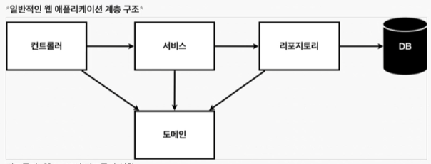
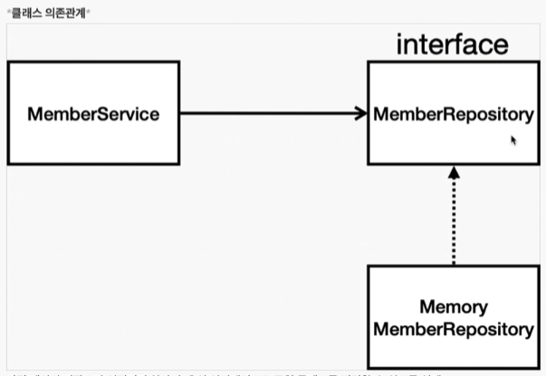

# 2강 - 회원 관리 예제

## 비즈니스 요구사항 정리
* 데이터: 회원 ID, 이름
* 기능: 회원 등록, 조회
* 아직 데이터 저장소가 선정되지 않음( 가상의 시나리오 )

### 일반적인 웹 어플리케이션 계층 구조

* 컨트롤러: 웹 MVC의 컨트롤러 역할
* 서비스: 핵심 비즈니스 로직 구현
* 리포지토리: 데이터베이스에 접근, 도메인 객체를 DB에 저장하고 관리
* 도메인: 비즈니스 도메인 객체
  * 예) 회원, 주문, 쿠폰 등등 주로 데이터베이스에 저장하고 관리됨

### 클래스 의존 관계

* 아직 데이터 저장소가 선정되지 않아서, 우선 인터페이스로 구현 클래스를 변경할 수 있도록 설계
* 데이터 저장소는 RDB, NoSQL 등등 다양한 저장소를 고민중인 상황으로 가정
* 개발을 진행하기 위해서 초기 개발 단계에서는 구현체로 가벼운 메모리 기반의 데이터 저장소 사용

## 회원 도메인과 리포지토리 만들기

### 회원 객체
`src/domain/Member.java`
```java
public class Member {
  private Long id;
  private String name;

  public Long getId() {
    return id;
  }

  public void setId(Long id) {
    this.id = id;
  }

  public String getName() {
    return name;
  }

  public void setName(String name) {
    this.name = name;
  }
}
```

### 회원 리포지토리 인터페이스
`src/repository/MemberRepository.java`
```java
public interface MemberRepository {
    Member save(Member member);
    Optional<Member> findById(Long id);
    Optional<Member> findByName(String name);
    List<Member> findAll();
}
```

### 회원 리포지토리 구현
`src/repository/MemoryMemberRepository.java`
```java
public class MemoryMemberRepository implements MemberRepository {
    private static Map<Long, Member> store = new HashMap<>();
    private static long sequence = 0L;

    @Override
    public Member save(Member member) {
        member.setId(++sequence);
        store.put(member.getId(), member);
        return member;
    }

    @Override
    public Optional<Member> findById(Long id) {
        return Optional.ofNullable(store.get(id));
    }

    @Override
    public Optional<Member> findByName(String name) {
        return store.values().stream()
                .filter(member -> member.getName().equals(name))
                .findAny();
    }

    @Override
    public List<Member> findAll() {
        return new ArrayList<Member>(store.values());
    }
}
```

## 회원 리포지토리 테스트 케이스 작성
개발한 기능을 실행해서 테스트 할 때 자바의 main 메서드를 통해서 실행하거나, 
웹 애플리케이션의 컨트롤러를 통해서 해당 기능을 실행한다.
이러한 방법은 준비하고 실행하는데 오래 걸리고, 반복 실행하기 어렵고, 여러 테스트를 한번에 실행하기 어렵다는 단점이 있다.
자바는 JUnit이라는 프레임워크로 테스트를 실행해서 이러한 문제를 해결한다.

### 회원 리포지토리 메모리 구현체 테스트
`test/repository/MemoryMemberRepositoryTest.java`
```java
public class MemoryMemberRepositoryTest {
  MemoryMemberRepository repository = new MemoryMemberRepository();

  @AfterEach
  public void afterEach() {
    repository.clearStore();
  }

  @Test
  public void save() {
    Member member = new Member();
    member.setName("spring");
    repository.save(member);

    Member result = repository.findById(member.getId()).get();
    // Assertions.assertEquals(member, result);
    assertThat(member).isEqualTo(result);
  }

  @Test
  public void findByName() {
    Member member1 = new Member();
    member1.setName("Spring 1");
    repository.save(member1);

    Member member2 = new Member();
    member2.setName("Spring 2");
    repository.save(member2);

    Member result = repository.findByName("Spring 2").get();

    assertThat(result).isNotEqualTo(member1);
    assertThat(result).isEqualTo(member2);
  }

  @Test
  public void findAll() {
    Member member1 = new Member();
    member1.setName("Spring 1");
    repository.save(member1);

    Member member2 = new Member();
    member2.setName("Spring 2");
    repository.save(member2);

    List<Member> result = repository.findAll();

    assertThat(result.size()).isEqualTo(2);
  }
}
```

* 각각의 테스트의 순서는 보장되지 않는다.
  * 각각의 개별 테스트는 순서에 의존되면 않된다.

## 회원 서비스 개발
`src/service/MemberService.java`
```java
public class MemberService {
    private final MemberRepository memberRepository = new MemoryMemberRepository();

    /**
     * 같은 이름이 있는 중복 회원 X
     */
    private void validateDuplicateMember(Member member) {
        memberRepository.findByName(member.getName())
                .ifPresent(m -> { // 값이 있다면,
                    throw new IllegalStateException("이미 존재하는 회원입니다.");
                });
    }

    /**
     * 회원 가입
     */
    public Long join(Member member) {
        validateDuplicateMember(member);

        memberRepository.save(member);
        return member.getId();
    }

    /**
     * 전체 회원 조회
     */
    public List<Member> findMembers() {
        return memberRepository.findAll();
    }

    /**
     * ID 기반 맴버 조회
     */
    public Optional<Member> findOne(Long memberId) {
        return memberRepository.findById(memberId);
    }
}
```

## 회원 서비스 테스트
`test/service/MemberServiceTest.java`
```java
class MemberServiceTest {
    MemberService memberService;
    MemoryMemberRepository memberRepository;

    @BeforeEach
    public void beforeEach() {
        memberRepository = new MemoryMemberRepository();
        memberService = new MemberService(memberRepository);
    }

    @AfterEach
    void afterEach() {
        memberRepository.clearStore();
    }

    @Test
    void 회원가입() {
        // given: 뭔가 주어지고
        Member member = new Member();
        member.setName("spring");

        // when: 이걸 실행했을때
        Long saveId = memberService.join(member);

        // then: 결과가 이거 나와야함
        Member findMember = memberService.findOne(saveId).get();
        assertThat(member.getId()).isEqualTo(findMember.getId());
    }

    @Test
    void 회원가입_중복회원예외() {
        // given
        Member member1 = new Member();
        member1.setName("spring");

        Member member2 = new Member();
        member2.setName("spring");

        // when
        memberService.join(member1);

        // then
        /*
        try {
            memberService.join(member2);
            fail("테스트 실패");
        } catch( IllegalStateException e ) {
            assertThat(e.getMessage()).isEqualTo("이미 존재하는 회원입니다.");
        }
        */
        IllegalStateException e = Assertions.assertThrows(IllegalStateException.class, () -> memberService.join(member2));
        assertThat(e.getMessage()).isEqualTo("이미 존재하는 회원입니다.");
    }
}
```