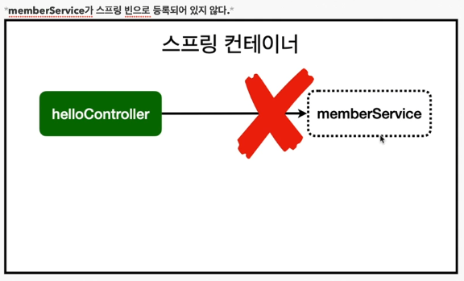
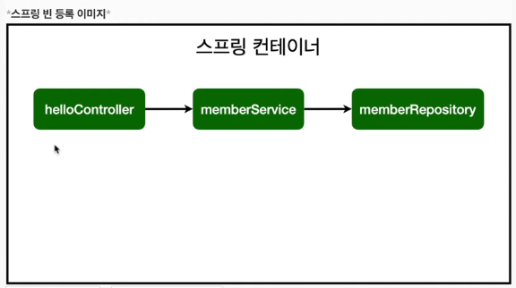

# 3강 - 스프링 빈과 의존관계

## 스프링 빈을 등록하고, 의존관계 설정하기
* 회원 컨트롤러가 회원서비스와 회원 리포지토리를 사용할 수 있게 의존관계를 준비하자.

### 회원 컨트롤러에 의존관계 추가
```java
@Controller
public class MemberController {
    private final MemberService memberService;

    @Autowired
    public MemberController(MemberService memberService) {
        this.memberService = memberService;
    }
}
```
* 생성자에 `@Autowired`가 있으면 스프링이 연관된 객체를 스프링 컨테이너에서 찾아서 넣어준다.
  이렇게 객체 의존관계를 외부에서 넣어주는 것은 DI (Dependency Injection), 의존성 주입이라 한다.
* 이전 테스트에서는 개발자가 직접 주입했고, 여기서는 `@Autowired`에 의해 스프링이 주입해준다.

### 에러
`Parameter 0 of constructor in hello.hellospring.controller.MemberController required a bean of type 'hello.hellospring.service.MemberService' that could not be found.`
* memberService가 스프링 빈으로 등록되어 있지 않다.


### 스프링 빈을 등록하는 2가지 방법
* 컴포넌트 스캔과 자동 의존관계 설정
* 자바 코드로 직접 스프링 빈 등록하기

## 컴포넌트 스캔과 자동 의존관계 설정
### Service 등록
```java
@Service
public class MemberService {
    private final MemberRepository memberRepository;

    @Autowired
    public MemberService(MemberRepository memberRepository) {
        this.memberRepository = memberRepository;
    }
    // ...
}
```

### Repository 등록
```java
@Repository
public class MemoryMemberRepository implements MemberRepository {
    // ...
}
```



> 참고:
> 스프링은 스프링 컨테이너에 스프링 빈을 등록할 때, 기본으로 싱글톤(Singleton)으로 등록한다.
> 따라서 같은 스프링 빈이면 모두 같은 인스턴스다.
> 설정으로 싱글톤이 아니게 설정할 수 있지만, 특별한 경우를 제외하면 대부분 싱글톤으로 사용한다.

## 자바 코드로 직접 스프링 빈 등록하기